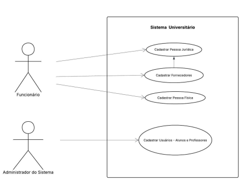
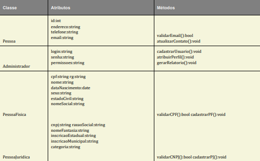
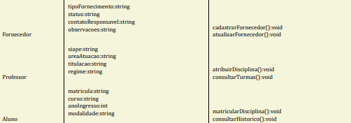

# University-Data-System-OOP
Projeto de Desenvolvimento de Sistemas Orientado a Objetos focado na modelagem e gestão eficiente dos dados acadêmicos e administrativos de uma grande instituição de ensino superior.
# Sistema de Dados Universitários POO

Projeto de Desenvolvimento de Sistemas Orientado a Objetos focado na modelagem e gestão eficiente de dados acadêmicos e administrativos de uma grande instituição de ensino superior.

---

## 1. Introdução e Visão Geral da Solução (PI - Fase 1)

O projeto apresenta um sistema de gestão de dados para uma universidade, focando no cadastro de pessoas físicas, jurídicas, usuários (alunos e professores) e fornecedores. O objetivo é desenvolver uma estrutura eficiente que permita o registro, atualização e consulta de informações relevantes.

### Objetivos

* Desenvolver um sistema integrado que centralize e automatize o cadastro de alunos, professores e fornecedores, melhorando a eficiência administrativa e a comunicação entre áreas.
* Garantir a segurança e conformidade legal dos dados, fornecendo ferramentas analíticas para a tomada de decisões informadas na gestão acadêmica.

---

## 2. Modelagem de Casos de Uso

A modelagem de casos de uso representa os cenários de cadastro de diferentes tipos de pessoas que interagem com o sistema.

### Diagrama de Caso de Uso

* **Atores:** Funcionário, Administrador do Sistema.
* **Casos de Uso Principais:** Cadastrar Pessoa Jurídica, Cadastrar Fornecedores, Cadastrar Pessoa Física, Cadastrar Usuários (Alunos e Professores).

---

## 3. Descrição Detalhada dos Cenários (Casos de Uso)

### 3.1. Caso de Uso 1: Cadastro de Pessoa Física

* **Ator Principal:** Funcionário responsável pelo cadastro.
* **Pré-condição:** O sistema deve estar em funcionamento, e o usuário (funcionário) deve estar autenticado no sistema.
* **Cenário Principal:** O funcionário acessa a funcionalidade "Cadastro de Pessoa Física", e o sistema exibe o formulário. O funcionário preenche os dados obrigatórios (Nome, CPF, RG, Endereço, Telefone, E-mail e Data de Nascimento), o sistema valida os dados informados (ex.: CPF válido e não duplicado), o funcionário confirma a operação. O sistema registra os dados no banco de dados e exibe mensagem de sucesso, disponibilizando a visualização do cadastro realizado.
* **Cenário Alternativo 1:** Se o CPF informado for inválido ou já estiver cadastrado, o sistema informa o erro e solicita a correção.
* **Cenário Alternativo 2:** Se o funcionário não preencher todos os campos obrigatórios, o sistema alerta sobre os campos faltantes e impede a conclusão do cadastro.
* **Pós-condição:** Os dados da pessoa física são armazenados no sistema, ficando disponíveis para consultas e relacionamentos futuros (ex.: vínculo como aluno ou professor).

### 3.2. Caso de Uso 2: Cadastro de Pessoa Jurídica

* **Ator Principal:** Funcionário responsável pelo cadastro.
* **Pré-condição:** O sistema deve estar em funcionamento, e o usuário (funcionário) deve estar autenticado no sistema.
* **Cenário Principal:** O funcionário acessa a funcionalidade “Cadastro de Pessoa Jurídica”, e o sistema exibe o formulário. O funcionário preenche os dados obrigatórios (Razão Social, Nome Fantasia, CNPJ, Endereço, Telefone e E-mail). O sistema valida os dados informados (ex.: CNPJ válido e não duplicado). O funcionário confirma a operação, o sistema registra os dados no banco de dados, e exibe mensagem de sucesso.
* **Cenário Alternativo 1:** Se o CNPJ informado for inválido ou já estiver cadastrado, o sistema informa o erro e solicita a correção.
* **Cenário Alternativo 2:** Se o funcionário não preencher todos os campos obrigatórios, o sistema alerta sobre os campos faltantes e impede a conclusão do cadastro.
* **Pós-condição:** Os dados da pessoa jurídica são armazenados no sistema, ficando disponíveis para consultas e relacionamentos futuros (ex.: vínculo como fornecedor).

### 3.3. Caso de Uso 3: Cadastro de Usuários (Alunos e Professores)

* **Ator Principal:** Administrador do Sistema.
* **Pré-condição:** O Administrador do Sistema deve estar autenticado, possuir privilégios de acesso e o sistema deve estar devidamente conectado ao banco de dados.
* **Cenário Principal:** O Administrador acessa a funcionalidade de cadastro de usuários. O sistema apresenta a opção de iniciar um novo cadastro de Pessoa Física, e o Administrador insere os dados pessoais obrigatórios. O Administrador seleciona o perfil (Aluno ou Professor), preenche os campos adicionais correspondentes e confirma a operação. O sistema executa a validação das informações, cria o registro da Pessoa Física e associa o perfil, e exibe mensagem de confirmação.
* **Cenário Alternativo 1 (Cadastro de Perfil em Pessoa Física existente):** O Administrador localiza uma Pessoa já cadastrada, e o sistema disponibiliza apenas os campos específicos para o novo perfil, validando e associando o perfil ao registro existente.
* **Cenário Alternativo 2 (Campos Obrigatórios não preenchidos):** O sistema detecta os campos ausentes, interrompe a operação e exibe mensagem de erro, permitindo a correção.
* **Cenário Alternativo 3 (Cadastro duplicado):** O Administrador tenta cadastrar um CPF já presente, o sistema rejeita a operação, exibe mensagem de duplicidade, e o formulário continua disponível para ajustes.
* **Cenário Alternativo 4 (Permissão insuficiente):** Um usuário sem perfil de Administrador tenta acessar, o sistema bloqueia o acesso e exibe “Acesso negado”.
* **Pós-condição (Sucesso):** Um novo registro de Pessoa Física (quando aplicável) e o respectivo perfil são criados no banco de dados.

### 3.4. Caso de Uso 4: Cadastro de Fornecedor

* **Ator Principal:** Funcionário do Setor Administrativo.
* **Pré-condição:** O funcionário deve estar autenticado no sistema, e o sistema deve estar conectado ao banco de dados.
* **Cenário Principal:** O funcionário acessa o sistema de gestão e seleciona a opção “Cadastro de Fornecedores”. O sistema apresenta a tela e o funcionário insere as informações obrigatórias (Razão social, CNPJ, Endereço, Telefone de contato, E-mail e Tipo de fornecimento). Após o preenchimento, o funcionário confirma o cadastro, o sistema valida os dados, armazena as informações e apresenta uma mensagem de sucesso.
* **Cenário Alternativo 1 (Dados incompletos):** Se o funcionário não preencher todos os campos obrigatórios, o sistema exibe uma mensagem de erro informando os campos que ainda precisam ser preenchidos.
* **Cenário Alternativo 2 (CNPJ inválido ou duplicado):** Caso o funcionário insira um CNPJ em formato inválido ou que já exista no sistema, o sistema bloqueia o cadastro e informa o motivo do erro.
* **Pós-condição:** O fornecedor é registrado no sistema e fica disponível para consultas e edições futuras.

---

## 4. Modelagem de Classes Orientada a Objetos

O diagrama de classes ilustra a estrutura das entidades envolvidas no sistema de cadastro.

### 4.1. Diagrama de Classes (Visão Geral)

### 4.2. Classes, Atributos e Métodos (Exemplos)

| Classe | Atributos (Exemplos) | Métodos (Exemplos) |
| :--- | :--- | :--- |
| **Pessoa** | `id:int`, `endereco:string`, `telefone:string`, `email:string` | `validarEmail():bool`, `atualizarContato():void` |
| **Pessoa Fisica** | `cpf:string`, `nome:string`, `dataNascimento:date` | `validarCPF():bool`, `cadastrarPF():void` |
| **Pessoa Juridica** | `cnpj:string`, `razaoSocial:string`, `nomeFantasia:string` | `validarCNPJ():bool`, `cadastrarPJ():void` |
| **Professor** | `siape:string`, `areaAtuacao:string`, `titulacao:string` | `atribuirDisciplina():void`, `consultarTurmas():void` |
| **Aluno** | `matricula:string`, `anoIngresso:int`, `modalidade:string` | `matricularDisciplina():void`, `consultarHistorico():void` |
| **Fornecedor** | `tipoFornecimento:string`, `status:string` | `cadastrarFornecedor():void`, `atualizarFornecedor():void` |

### 4.3. Relacionamentos

* Pessoa é superclasse de Aluno e Professor.
* Curso possui várias Disciplinas.
* Aluno está matriculado em várias Disciplinas.
* Professor ministra várias Disciplinas.

---

## 5. Próximos Passos (Fase 2: Prototipação e Configuração do GitHub)

Esta seção será preenchida na segunda entrega do PI, conforme os requisitos de prototipação das interfaces e a organização dos colaboradores no repositório.
